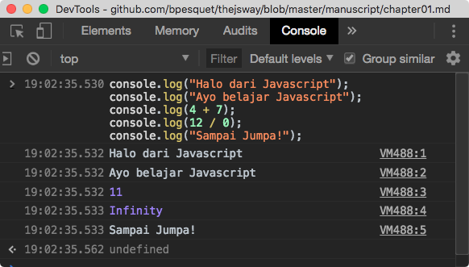

# Memulai Koding

## Program Pertama
Ini adalah program pertama kita.
```js
console.log("Halo DevC Bali!");
```

## Value dan Tipedata
Sebuah **value** adalah potongan informasi yang disimpan dalam program. Setiap value disimpan dalam bentuk yang berbeda disebut Tipedata. Tipedata-lah yang menentukan nilai yang bisa disimpan dalam **value** dan operasi yang bisa dilakukan terhadap **value** tersebut.

Setiap bahasa pemrograman memiliki **value** dan tipedata masing-masing. Berikut adalah tipedata dalam Javascript

### Number
Number adalah numerikal **value**, Seperti dalam matematika Anda dapat menggunakan bilangan bulat (0, 1, 2, 3, ...) atau bilangan desimal untuk akurasi yang lebih baik.

Number banyak digunakan untuk proses perhitungan. Operasi yang dapat dilakukan untuk tipedata Number adalah.

|Operator|Kegunaan|
|---------|----|
|`+`|Penambahan|
|`-`|Pengurangan|
|`*`|Perkalian|
|`/`|Pembagian|

### String
String dalam Javascript adalah text yang diapit oleh tanda kutip, misal `"Ini sebuah string."`.

Anda juga dapat mendefinisikan string dengan tanda kutip satu, misal, `'Ini sebuah string.'`. Kapan menggunakan kutip dua dan kutip satu? Pilihlah salah satu, jika sudah menentukan pilihan cobalah untuk konsisten untuk terus menggunakannya dalam satu program.

> Ingatlah selalu menutup string dengan tanda yang Anda gunakan untuk memulai string tersebut.

Anda tidak dapat menambah dan mengurangi string seperti yang dapat dilakukan pada tipedata Number. Namun dengan menggunakan operator `+` diantara 2 String akan menggabungkan value kedua string tersebut. Misal, `"Java" + "script"` akan menghasilkan `"Javascript"`


## Struktur Program

### Statement
Setiap instruksi dalam program disebut statement. Statement dalam Javascript biasanya diakhiri dengan titik koma (sebenarnya tidak wajib). Sebuah program akan terdiri dari kumpulan statement.

> Statement biasanya hanya terdiri dari 1 baris.

### Execution Flow
Saat program dieksekusi, statement biasanya saling tergantung satu sama lain. Kombinasi ini yang akan menghasilkan/mengerjakan sesuatu.

Berikut adalah contoh kumpulan dari beberapa statement, disertai dengan hasilnya.
```js
console.log("Halo dari Javascript");
console.log("Ayo belajar Javascript");
console.log(4 + 7);
console.log(12 / 0);
console.log("Sampai Jumpa!");
```



### Komentar
Statement yang diawali dengan tanda `//` akan dianggap sebagai komentar dan tidak akan dieksekusi.
```js
console.log("Halo dari Javascript");
// console.log("Ayo belajar Javascript");
console.log(4 + 7);
// console.log(12 / 0);
console.log("Sampai Jumpa!");
```

## Waktunya Koding!

Sekarang saatnya mempraktekan ilmu diatas.

### Presentasi

Tulislah program yang memunculkan nama dan umur Anda. Berikut adalah hasil output program saya.


### Kalkulator Minimalis
Tulislah program yang menjumlahkan, mengurangi, kali, dan bagi angka 6 dengan 3.

### Prediksi Output
Apakah output yang dihasilkan dari program dibawah.
```js
console.log(4 + 5);
console.log("4 + 5");
console.log("4" + "5");
```

Pastikan jawaban Anda dengan mengeksekusi program tersebut.